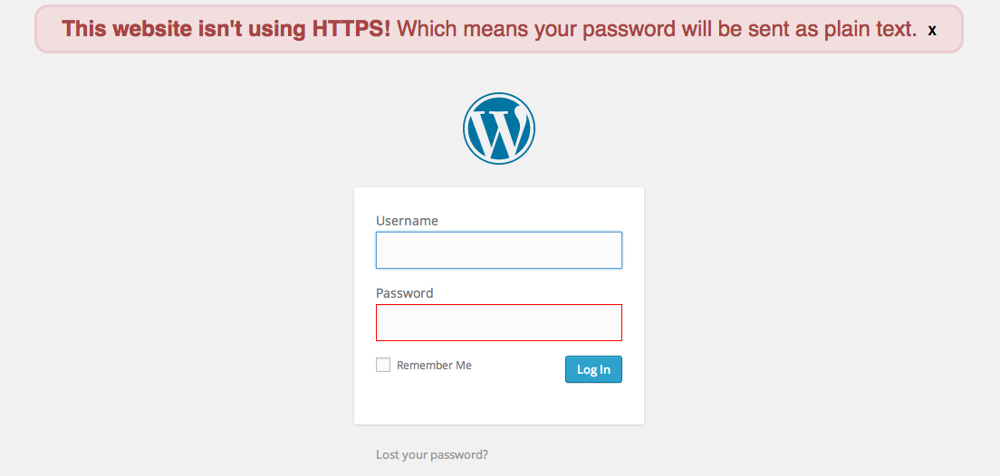

Chrome Plaintext Password Warning
===

This Chrome extension warns you if a website offers you a login form but isn't secured by HTTPS, which means that **your password will be sent to the server in plaintext!**

## Screenshot

## License

This project is licensed under the terms of the MIT license.